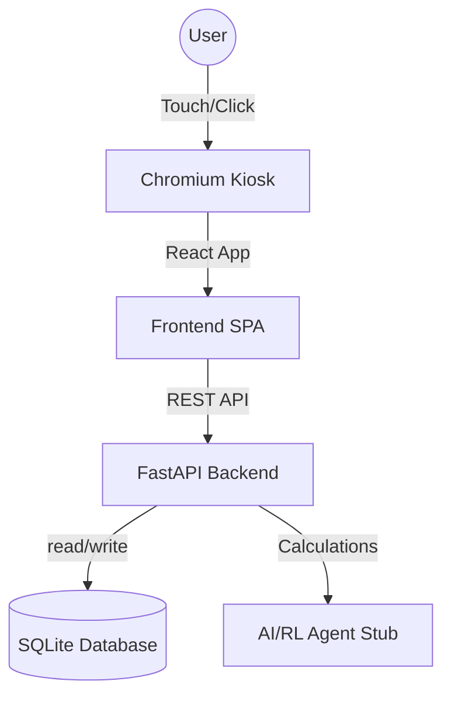

# Implementation Plan - CODEX '26 Kiosk System

## Goal Description
Build a "Kiosk System" for a Retail Supply Chain problem (CODEX '26). The system will run on an Ubuntu laptop in Kiosk mode, presenting a unified interface for Login, Retailer Portal, Supplier Portal, and Customer Shopping. The focus is on low memory usage, performance, and the ability to develop on Windows and deploy on Ubuntu.

## Architecture & Tech Stack

### Tech Stack
- **Backend:** **FastAPI** (Python).
  - *Reasoning:* High performance, low memory overhead compared to other Python frameworks, excellent support for Async IO, and ideal for integrating future AI/ML components (as per problem statement).
- **Frontend:** **React** (Vite) + **TailwindCSS**.
  - *Reasoning:* Industry standard, component-based, produces highly optimized static builds. Vite is extremely fast. Tailwind ensures a "premium" look with minimal CSS bloat.
- **Database:** **SQLite**.
  - *Reasoning:* Zero configuration, single-file, extremely low memory footprint. Perfect for a hackathon/kiosk setup where complex database orchestration is unnecessary overhead.
- **Deployment:** **Ubuntu Kiosk Mode**.
  - *Window Manager:* `Openbox` (or similar lightweight WM) instead of GNOME.
  - *Browser:* Chromium in `--kiosk` mode.
  - *Process Manager:* Systemd services.

## Winning Factors (The "Special Sauce")
1. **Interactive Multi-Agent Visualization**: Distinct from standard dashboards, we will have a "Live Neural Link" overlay. When a Customer buys an item, the User sees a signal fly to the Retailer Agent (stock update) and the Supplier Agent (restock probability analysis).
2. **Edge-Native Efficiency**: By using FastAPI + SQLite + Openbox, we demonstrate that this complex AI system can run on ~$35 hardware (Raspberry Pi class) or repurposed old laptops, democratizing AI for small business.
3. **Unified Feedback Loop**: All three portals (Customer, Retailer, Supplier) are running in one verified loop. No API fragmentation.

## Architecture Diagram


## User Review Required
> [!IMPORTANT]
> **Memory Usage Strategy**: To minimize memory, the Ubuntu implementation will NOT use the standard desktop environment (like GNOME). Instead, we will configure a custom X11 session that launches *only* the browser. This saves ~1-2GB of RAM.

## Proposed Changes

### 1. Project Structure
We will create a monorepo structure in `d:/Personal Projects/CODEX26/Orbita`:
```
/Orbita
  /backend
    /app
      main.py
      models.py
      routers/
    requirements.txt
    run.sh
  /frontend
    /src
      components/
      pages/
    package.json
  /kiosk-scripts
    setup_kiosk.sh
    start_browser.sh
  README.md
```

### 2. Backend (FastAPI)
- **FastAPI** for the REST API.
- **SQLAlchemy** (Async) for ORM.
- **Pydantic** for data validation.
- **JWT** for lightweight, stateless authentication.

### 3. Frontend (React)
- **Vite** for building.
- **React Router** for navigating between Login, Retailer, Supplier, Customer views.
- **Zustand** for lightweight state management (easier/lighter than Redux).
- **[NEW] "Agent Mind" Component**: A floating or sidebar component that logs "Agent Thoughts" (e.g., "Retailer Agent: Stock low on Apples, requesting Quote...").
- **[NEW] Resource Monitor**: A small pill badge showing current RAM usage (mocked or real via API) to prove the "efficiency" point.

### 4. Kiosk Mode (Ubuntu)
- We will provide a `setup_kiosk.sh` script that:
  - Installs `openbox`, `chromium-browser`, `xorg`.
  - Configures `.xinitrc` to launch the backend and then the browser in full screen.
  - Sets up auto-login.

## Verification Plan

### Automated Tests
- Run backend tests: `pytest`
- Run frontend build check: `npm run build`

### Manual Verification
1. **Windows Dev:** Run `uvicorn` and `npm run dev`. Verify Login -> Portals flow.
2. **Ubuntu Kiosk:** Boot Ubuntu laptop. Run `setup_kiosk.sh`. Reboot. Verify system boots directly into the Web App fullscreen.
